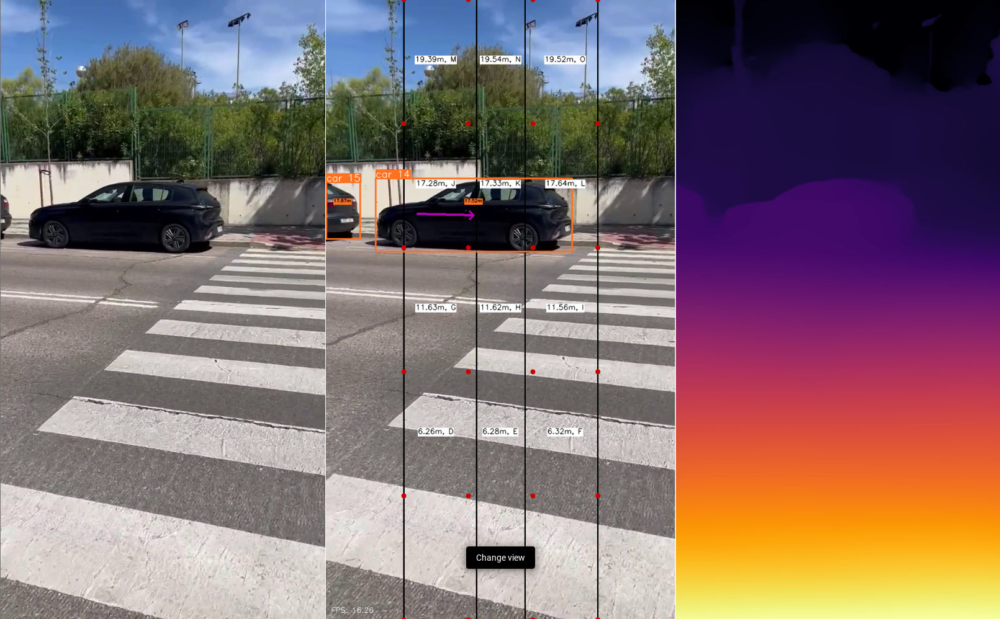

# Sistema de Detección de Objetos con Asistencia de Audio para Personas con Discapacidad Visual

## Descripción del Proyecto
Este proyecto, titulado "Desarrollo de un Sistema de Detección de Objetos con Asistencia de Audio para Personas con Discapacidad Visual", tiene como objetivo crear una herramienta tecnológica inclusiva que permita a personas con discapacidad visual interpretar su entorno de manera autónoma y segura. Utiliza tecnologías avanzadas como OpenCV, y el algoritmo YOLO v8 para integrar visión computarizada y procesamiento de audio, generando descripciones sonoras de objetos detectados.



## Tabla de Contenidos
- [Requisitos](#requisitos)
- [Instalación](#instalación)
- [Uso](#uso)
- [Tecnologías Utilizadas](#tecnologías-utilizadas)
- [Estructura del Proyecto](#estructura-del-proyecto)
- [Licencia](#licencia)


## Requisitos
Para instalar y ejecutar el proyecto, asegúrate de tener instalados los siguientes requisitos:

- Python 3
- Las librerías listadas en `requirements.txt`

## Instalación
1. Clona este repositorio:
    ```bash
    git clone https://github.com/elenagonzalezrebollo/PFG
    ```
2. Navega al directorio del proyecto:
    ```bash
    cd PFG
    ```
3. Inicia el setup del proyecto:
    ```bash
    .\setup_project.ps1
    ```

## Uso
1. Navega al directorio del codigo fuente:
    ```bash
    cd src
    ```
2. Ejecuta el script principal:
    ```bash
    python main.py
    ```

## Tecnologías Utilizadas
- **YOLO v8**: Algoritmo avanzado para la detección de objetos en tiempo real.
- **MiDaS**: Modelo para la estimación de profundidad a partir de imágenes monoculares.
- **OpenCV**: Biblioteca de código abierto para el procesamiento de imágenes y vídeo.
- **Kivy**: Framework de Python para el desarrollo de interfaces de usuario en aplicaciones móviles.
- **Torch**: Biblioteca de aprendizaje profundo de código abierto.
- **numpy**: Librería para la manipulación de arreglos y matrices.
- **gTTS**: Librería para la conversión de texto a voz.
- **playsound**: Librería para la reproducción de archivos de audio.

## Estructura del Proyecto
- **`app`**: Directorio principal del proyecto.
    - **`img`**: Directorio con las imágenes del proyecto (capturas de pantalla, etc.)
    - **`src`**: Directorio con el código fuente del proyecto.
        - **`audio`**: Directorio con los archivos de audio generados.
        - **`video`**: Directorio con los archivos de vídeo utilizados para pruebas.
        - **`models`**: Directorio con los modelos de aprendizaje profundo.
        - **`main.py`**: Script principal del proyecto.
        - **`model.py`**: Clase con la definición del modelo implementado.
    - **`requirements.txt`**: Archivo con las dependencias del proyecto.
    - **`setup_project.ps1`**: Script de PowerShell para la instalación de las dependencias.

## Licencia
Este proyecto está licenciado bajo los términos de la licencia MIT. Consulta el archivo LICENSE para más detalles.

---

**Universidad Francisco de Vitoria**  
**Escuela Politécnica Superior**  
**Grado en Ingeniería Matemática**
